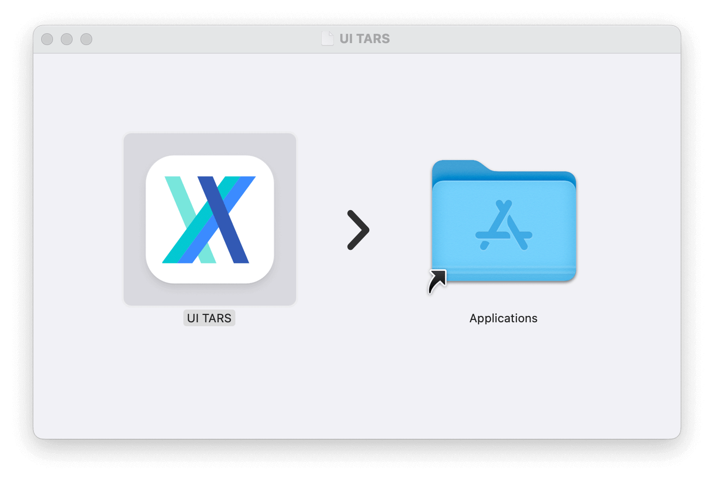
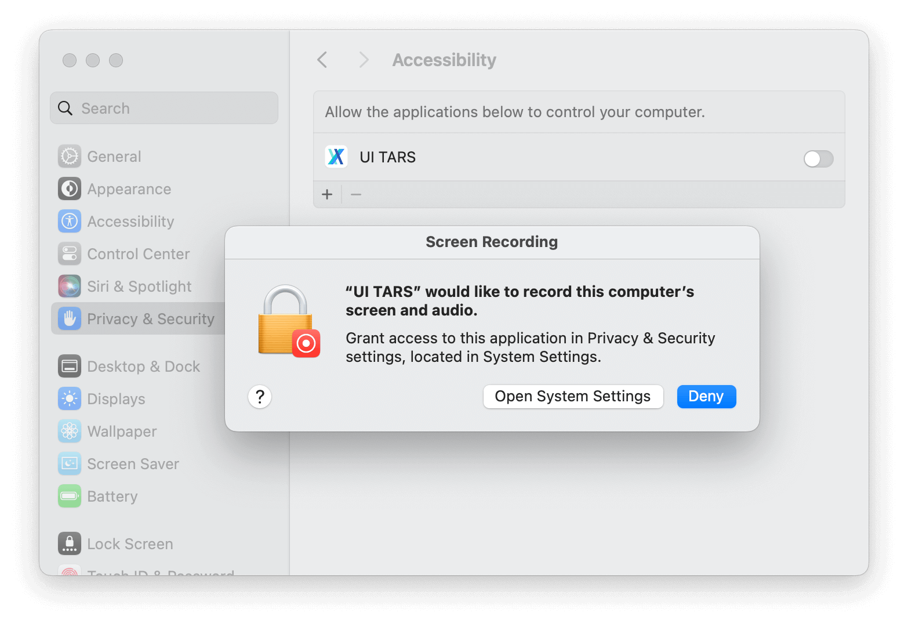
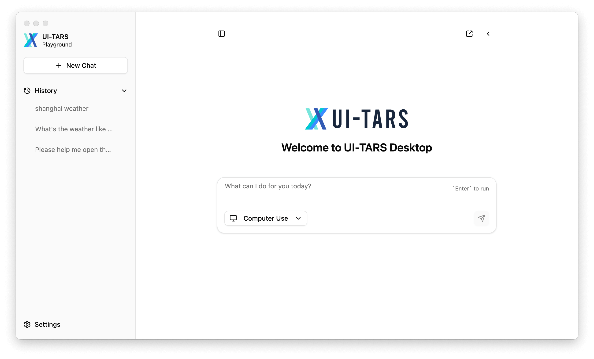
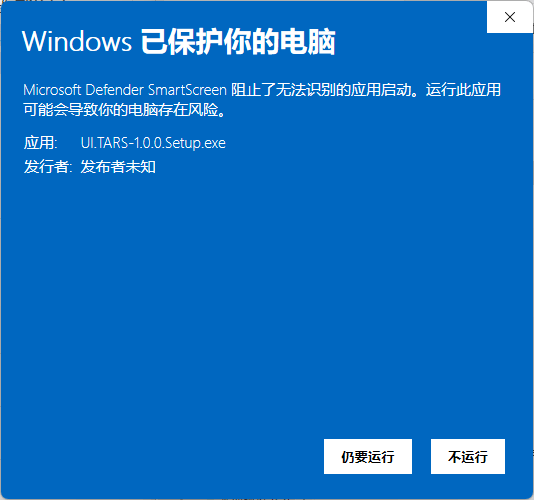
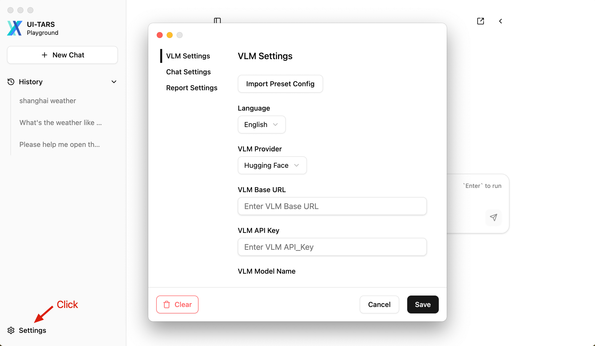
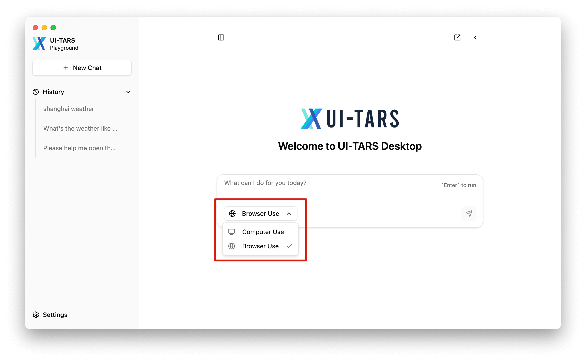

# Quick Start

## Download

You can download the [latest release](https://github.com/bytedance/UI-TARS-desktop/releases/latest) version of UI-TARS Desktop from our releases page.

> **Note**: If you have [Homebrew](https://brew.sh/) installed, you can install UI-TARS Desktop by running the following command:
> ```bash
> brew install --cask ui-tars
> ```

## Install

### MacOS

1. Drag **UI TARS** application into the **Applications** folder
  

2. Enable the permission of **UI TARS** in MacOS:
  - System Settings -> Privacy & Security -> **Accessibility**
  - System Settings -> Privacy & Security -> **Screen Recording**
  

3. Then open **UI TARS** application, you can see the following interface:
  


### Windows

**Still to run** the application, you can see the following interface:



## Add your model settings

> Refer to [Deployment](https://github.com/bytedance/UI-TARS/blob/main/README_deploy.md) for more information about the UI-TARS-1.5's latest deployment methods.

1. Click the **Settings** button on the bottom left corner of the application
  
2. Read the [Settings Configuration Guide](./setting.md) and set up VLM/Chat parameters
3. Select the desired usage scenario before starting a new chat
  
